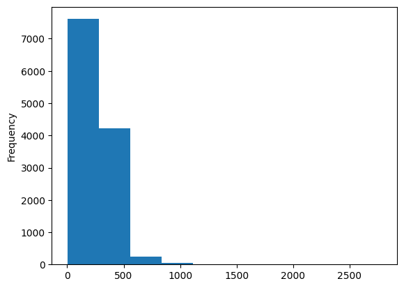
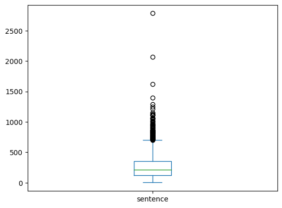
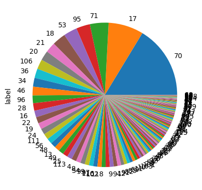

# Wisers AI Lab Coding Test
-----------

|||
|:---|:---|
|Name|Jiahe geng

## Files\Folders:
`Wisers_NLP_Task.ipynb`, `readme.md`, `label_pie.png`, `text_length_box.png`,`label_pie.png`, `iflytek_public`

## Notice:
Befor you execute `.ipynb` , please 
make sure that the file path in the code is correct.

## Library:
|||
|:---|:---|
|numpy|1.17.4
|scikit-learn|1.2.2
|pandas|1.5.3
|numpy|1.22.4
|matplotlib|3.7.1
|pytorch|2.0.0+cu118
|focal_loss|0.1.1
|jieba|0.42.1
|transformers|4.28.1
|tokenizers|0.13.3
|huggingface-hub|0.13.4

## Exploratory Data Analysis

### Alternative easy data augmentation
Due to the distribution of length of the sentences, it is allowed to use simple truncation and padding technique, but not other text splitting technique.  
Also, the `back-translation` is also a alternative way to do the data augumentation to conquer the imbalance dataset problem. However, due to time constraints, here I used the `Focal loss` to overcome the imbalance dataset problem

## Model Architecture:
#### BertForClassification(
    BertEmbeddings(word_embeddings + position_embeddings + token_type_embeddings + LayerNorm + dropout)  
    |  
    12 *  
    {BertEncoder( position_embeddings + token_type_embeddings + LayerNorm + dropout)  
    |  
    BertSelfOutput(dense + LayerNorm + dropout)  
    |  
    BertIntermediate(dense + intermediate_act_fn)  
    |  
    BertOutput(dense + LayerNorm + dropout)  
    }  
    |  
    BertPooler(dense + activation)  
    |  
    Dropout  
    |  
    Dense  
)  

#### BertLSTMForClassification(  
    BertEmbeddings(word_embeddings + position_embeddings + token_type_embeddings + LayerNorm + dropout)  
    |  
    12 *  
    {BertEncoder( position_embeddings + token_type_embeddings + LayerNorm + dropout)  
    |  
    BertSelfOutput(dense + LayerNorm + dropout)  
    |  
    BertIntermediate(dense + intermediate_act_fn)  
    |  
    BertOutput(dense + LayerNorm + dropout)  
    }  
    |  
    BertPooler(dense + activation)  
    |  
    Dropout  
    |  
    LSTM  
    |  
    Dense  
)

## Experiment Results
### The results are based on 10 epochs, batch_size = 8, max_length = 512
##### Validation
||||||
|:---|:---|:---|:---|:---|
|Method|Accuracy|Precision|Recall|F1
ValinaBert|0.6205|0.3960|0.3790|0.3602
Bert+Focal|0.5620|0.3793|0.4786|0.3982
BertLSTM+Focal|0.4718|0.2853|0.3317|0.2524

#### Dev Dataset
||||||
|:---|:---|:---|:---|:---|
|Method|Accuracy|Precision|Recall|F1
ValinaBert|0.6017|0.3638|0.3697|0.3414
Bert+Focal|0.5475|0.3644|0.4477|0.3732
BertLSTM+Focal|0.2523|0.2523|0.3146|0.2409

## Instructions:
#### Data split:
For the train dataset, I used 80% of  "train set" to train the model, and 20% as the validation set. What is more, I used "dev set" as the test set evaluate the model performances. 
#### Data preprocessing:
I used `nltk` to delete the stop words and punctuations. 
#### Model training 
The training process is 10 epochs, batch_size = 8 (due to the constraints of the GPU, the increase in batch size can significantly improve performance ), max_length = 512.
#### Model selection
After the experiment, according to the result, the best modle would be `Bert+Focal`.